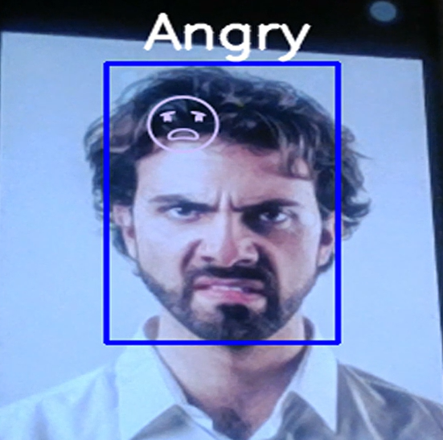
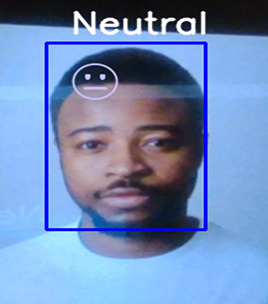
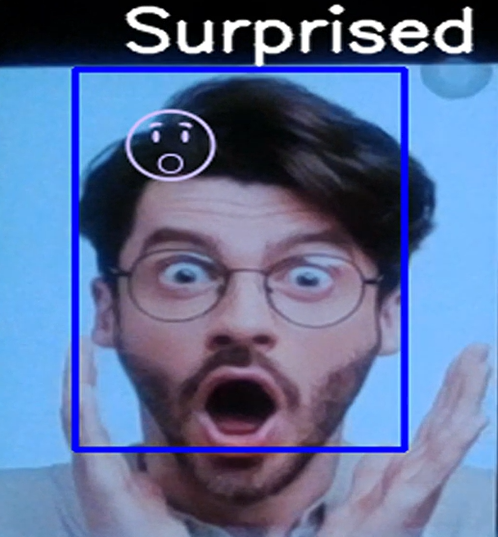

# Emotion-To-Emojis
A real-time facial emotion detection project that analyzes facial expressions and displays corresponding emojis.
This project combines face detection, emotion analysis, and real-time emoji generation to provide an interactive experience capturing emotions in front of a camera. The model, trained on the FER2013 dataset, can detect emotions such as "Angry," "Disgusted," "Fearful," "Happy," "Neutral," "Sad," and "Surprised."

## Getting Started

### Dataset Preparation
1. Run `dataset_preparation.py` to split the FER2013 dataset into training and test datasets.

### Model Training
2. Use `training.py` to train the emotion detection model.

### Real-time Emoji Generation
3. Run `emotion_2_emojis.py` to capture emotions in real-time and display corresponding emojis and text.

## Dependencies
- `numpy`
- `argparse`
- `matplotlib`
- `cv2`
- `tensorflow`
- `emoji`
- `PIL`

## Usage
1. Ensure all dependencies are installed.
2. Follow dataset preparation and model training steps.
3. Run `emotion_2_emojis.py` for real-time emoji generation.

## Sample Results

  
  
  
  

